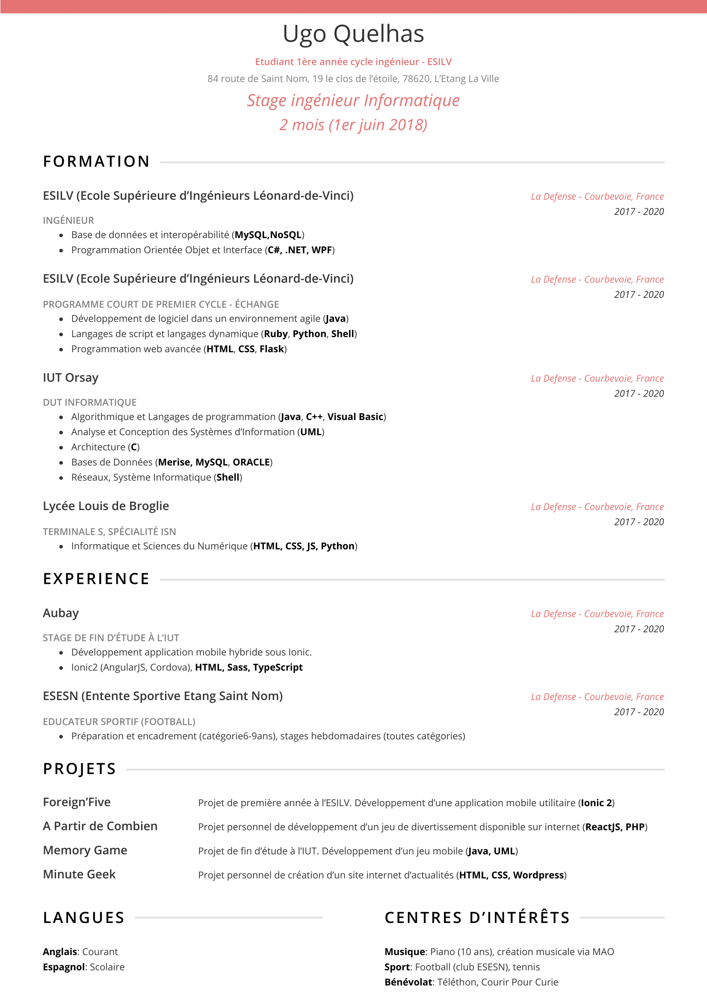

<main class="markdown-body">

# Markdown Resume
> Make your resume with markdown language

## Example

## Usage
### Import
- Install [Markdown Enhanced Preview](https://shd101wyy.github.io/markdown-preview-enhanced/#/) on Atom or Visual Studio Code.
- Import the _resume.less_ file in the [Customize CSS](https://shd101wyy.github.io/markdown-preview-enhanced/#/customize-css) part of the plugin :
`@import url('../path-to-the-directory/resume-markdown/resume.less');`

### Customization
Change the color, font-size etc. with the CSS var.
- `primary`: primary color
- `name` : name
- `h1`
- `h2`
- `h3`
- `main-font-size`: size of all text
</main>