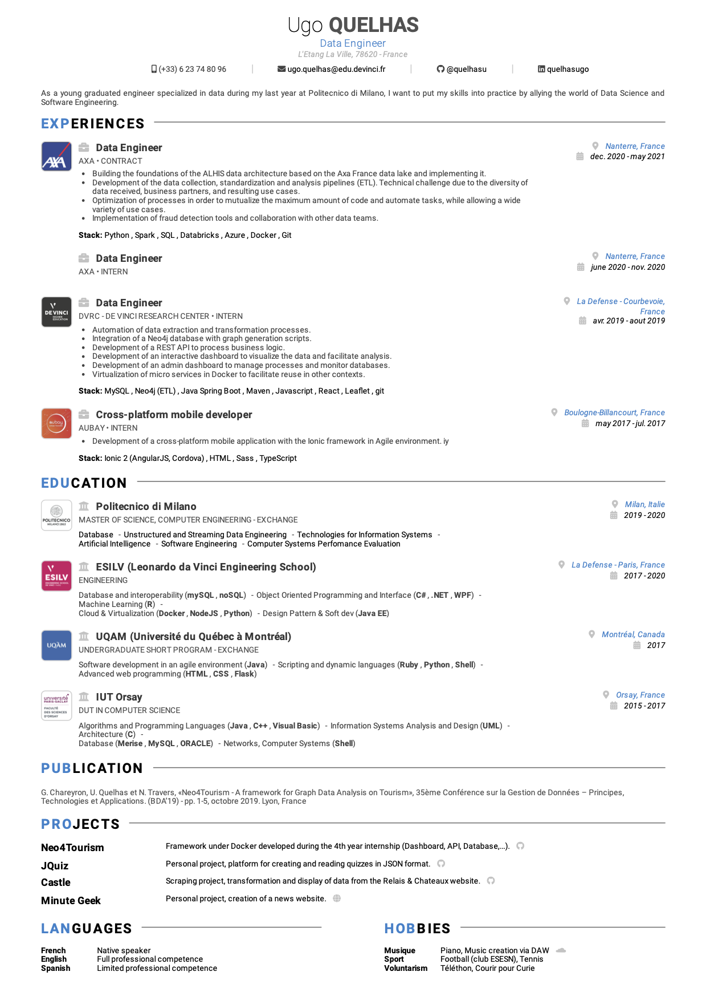

# Pug Resume Template
> Resume template with pug

## Example


## Usage
Install all dependencies and run gulp:
```bash
npm run setup
```

Build pug file and create html file:
```bash
npm run build
```

Development
```bash
npm run dev
```

## Customization

### Content
Modify `locales/*` files to change the resume content.

### Stylesheet
Change the color, font-size etc. with the CSS var. in `src/style/resume.less` file:
- `primary`: primary color
- `color`: text color
- `name` : name
- `h1`
- `h2`
- `h3`
- `main-font-size`: size of all text

## HTML to PDF
```bash
$ chrome --headless --disable-gpu --print-to-pdf=path/to/dest --no-margins path/to/html/file
```